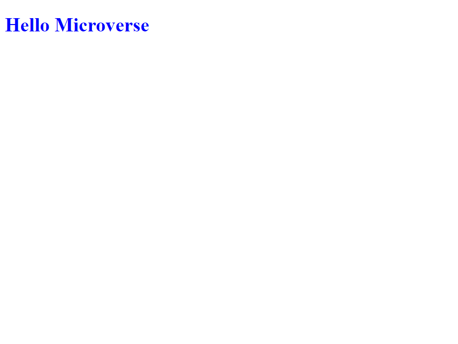

# Hello-Microverse

> The Hello Microverse project displays the skills I have to set up the Linters config file to debug and fix errors.

This project includes HTML and CSS files, and I have added a .gitignore file to ignore the test.md and node_modules/ files which are not necessary.

## Built With

- HTML
- CSS

## Getting Started
To get a local copy up and running follow these simple example steps.

- You can clone this repo by typing git clone 'https://github.com/OLIPLICHE/Hello-Microverse.git' on your terminal
- Type cd 'Hello-Microverse' to access the project on the terminal

### Prerequisites
- Text editor
- Git
- Html
- Css

👤 **paka**

- GitHub: [@githubhandle](https://github.com/OLIPLICHE)
- LinkedIn: [LinkedIn](https://www.linkedin.com/in/olipliche-paka-mavoungou/)

## 🤝 Contributing

Contributions, issues, and feature requests are welcome!

Feel free to check the [issues page](https://github.com/OLIPLICHE/Hello-Microverse/issues).

## Show your support

Give a ⭐️ if you like this project!

## 📝 License

This project is [MIT](./MIT.md) licensed.